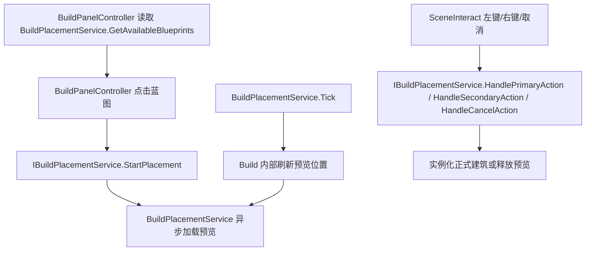

# Build 模块说明

## 1. 模块交互

### 对外接口

| 接口 | 说明 |
| --- | --- |
| `IBuildPlacementService.StartPlacement` | 基于蓝图标识进入建造模式 |
| `IBuildPlacementService.HandlePrimaryAction` | 处理建造模式下的左键放置 |
| `IBuildPlacementService.HandleSecondaryAction` | 处理建造模式下的右键取消 |
| `IBuildPlacementService.HandleCancelAction` | 处理建造模式下的取消输入 |

### 外部模块依赖

#### `UI`

| 模块接口 | 描述说明 |
| --- | --- |
| `BasePanel.PanelId` | 为建造面板提供统一面板生命周期与标识入口 |
| `UIPanelId.Build` | 读取建造面板固定面板标识 |

#### `Common`

| 模块接口 | 描述说明 |
| --- | --- |
| `PointerContextService.GetPointerContext` | 复用共享层的指针命中查询能力，统一地面命中与 UI 悬停判定 |

#### `VContainer`

| 模块接口 | 描述说明 |
| --- | --- |
| `IObjectResolver.InjectGameObject` | 为 Addressable 实例化出的建筑对象执行依赖注入 |
| `ITickable.Tick` | 每帧驱动建造预览跟随鼠标更新 |

#### `Unity Addressables`

| 模块接口 | 描述说明 |
| --- | --- |
| `AssetReferenceGameObject.InstantiateAsync` | 异步实例化建造预览与正式建筑 |
| `Addressables.ReleaseInstance` | 释放已取消的建造预览实例 |

## 2. 模块流程图

## 3. 当前实现备注

| 项 | 说明 |
| --- | --- |
| 当前风险 | 预览与正式建筑当前共用同一预制体，若后续建筑运行时脚本变重，需要继续补“预览材质”和更彻底的逻辑裁剪 |
| 当前限制 | 合法性判定当前统一通过；放置成功后默认退出建造模式；目录资产仍需在场景装配中显式绑定 |
| 当前结论 | `BuildPanelController` 已改为模块内直接依赖 `BuildPlacementService`，`IBuildPlacementService` 只保留跨模块放置契约 |
| 后续建议 | 下一步补占地检测、材质高亮、连续建造与建造成功事件 |
