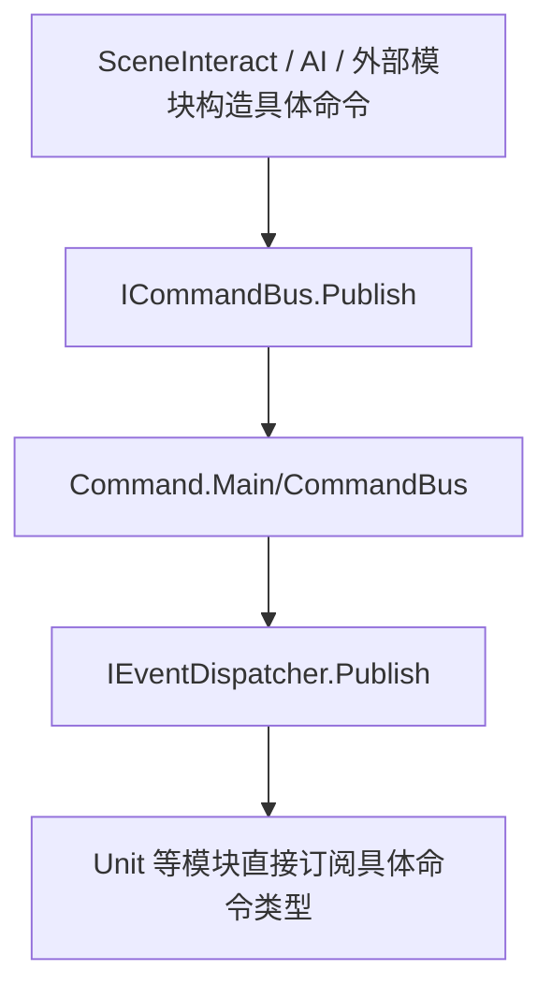

# Command 模块说明

## 1. 模块交互

### 对外接口

| 接口 | 说明 |
| --- | --- |
| `Contracts/ICommandMessage` | 命令消息基础契约 |
| `Contracts/ICommandBus` | 提供强类型命令发送与订阅入口 |

### 外部模块依赖

#### `Shared`

| 模块接口 | 描述说明 |
| --- | --- |
| `IEventDispatcher.Publish` | 将命令发送转换为共享强类型事件广播 |
| `IEventDispatcher.Subscribe` | 提供强类型命令订阅底座 |
| `IGameEvent` | 作为命令消息契约的基础标记接口 |
| `GameLog.Log` | 输出命令派发调试日志 |

## 2. 模块流程图

## 3. 当前实现备注

| 项 | 说明 |
| --- | --- |
| 当前结论 | `Command` 已恢复为 `Contracts + Main` 双程序集，只保留强类型命令总线，不再承载移动、攻击等具体业务命令 |
| 当前限制 | 当前命令总线仍基于进程内同步分发，不提供排队、回放和跨线程能力 |
| 后续建议 | 后续新增命令时优先新增具体命令结构体，不要再回退到 `CommandType + switch` 模式 |
