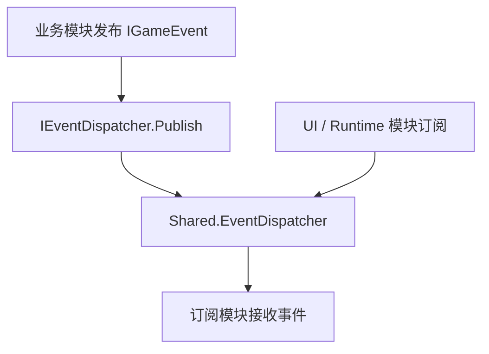

# Shared 模块说明

## 1. 模块交互

### 对外接口

| 接口 | 说明 |
| --- | --- |
| `IEventDispatcher.Publish` | 提供跨模块事件发布入口，用于广播已发生的业务事实 |
| `IEventDispatcher.Subscribe` | 提供跨模块事件订阅入口，用于监听共享业务事件 |
| `IEventDispatcher.Unsubscribe` | 提供跨模块事件注销入口，用于显式解除订阅 |

### 外部模块依赖

#### `UnityEngine`

| 模块接口 | 描述说明 |
| --- | --- |
| `DebugOverlay` | 使用 UI Toolkit 渲染调试输出 |
| `GameLog` | 转发日志到 Unity Console |

#### `VContainer`

| 模块接口 | 描述说明 |
| --- | --- |
| `IContainerBuilder.Register` | 由装配层将共享服务注册为单例 |

## 2. 模块流程图

## 3. 当前实现备注

| 项 | 说明 |
| --- | --- |
| 当前风险 | 若后续把命令语义塞进事件，会重新引入隐式耦合 |
| 当前限制 | 当前只提供同步内存内分发，不提供粘性事件、优先级、回放和跨线程能力 |
| 当前结论 | `Shared` 只保留共享定义、事件与基础运行时能力，不再承载 `UnitState` 这类业务归属明确的模块状态 |

## 4. 指针上下文能力

| 文件 | 说明 |
| --- | --- |
| `Utilities/Input/PointerContext.cs` | 统一描述屏幕坐标、UI 悬停、场景命中与地面命中结果 |
| `Utilities/Input/PointerContextService.cs` | 提供共享层指针射线检测与调试输出能力，供 `SceneInteract`、`Build` 复用 |
