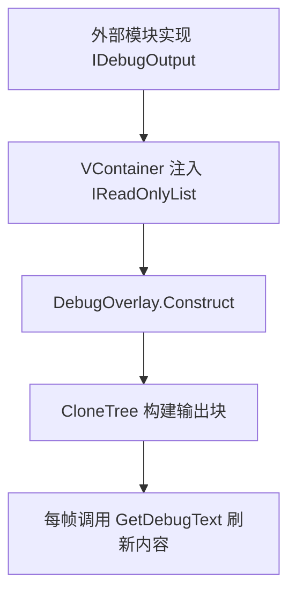

# Shared.Runtime.Debug 模块说明

## 1. 模块交互

### 对外接口

| 接口 | 说明 |
| --- | --- |
| `IDebugOutput.OutputName` | 约定调试输出源标题读取接口，供外部模块实现自己的调试输出源 |
| `IDebugOutput.GetDebugText` | 约定调试文本读取接口，供外部模块按帧输出调试内容 |
| `DebugOverlay.Construct(IReadOnlyList<IDebugOutput>)` | 调试叠层接收全部调试输出源的注入入口 |

### 外部模块依赖

#### `Shared.Runtime.Logging`

| 模块接口 | 描述说明 |
| --- | --- |
| `GameLog.Log` | 输出调试叠层初始化与构建日志 |
| `GameLogModule.Debug` | 标记调试叠层日志所属模块 |

#### `UnityEngine.UIElements`

| 模块接口 | 描述说明 |
| --- | --- |
| `UIDocument.panelSettings` | 绑定调试叠层使用的 PanelSettings |
| `UIDocument.rootVisualElement` | 获取调试叠层根节点 |
| `VisualTreeAsset.CloneTree` | 为每个调试输出源克隆一份 UXML 模板 |
| `VisualElement.Q<Label>` | 查询模板中的标题与内容标签 |
| `VisualElement.Add` | 将克隆出的调试块挂到叠层根节点 |

#### `VContainer`

| 模块接口 | 描述说明 |
| --- | --- |
| `[Inject]` / `Construct(IReadOnlyList<IDebugOutput>)` | 通过依赖注入收集所有调试输出源实现 |

#### `UnityEngine`

| 模块接口 | 描述说明 |
| --- | --- |
| `GetComponent<UIDocument>` | 获取当前对象上的 UI 文档组件 |

## 2. 模块流程图

## 3. 当前实现备注

| 项 | 说明 |
| --- | --- |
| 当前风险 | `outputTemplate` 和 `panelSettings` 依赖 Inspector 绑定，缺失时会在运行时暴露问题 |
| 当前限制 | 当前仅提供静态叠层显示能力，不支持运行时筛选、折叠或分页 |
| 后续建议 | 后续如调试输出源增多，可补分类、开关与滚动支持，避免单层文本过长 |
