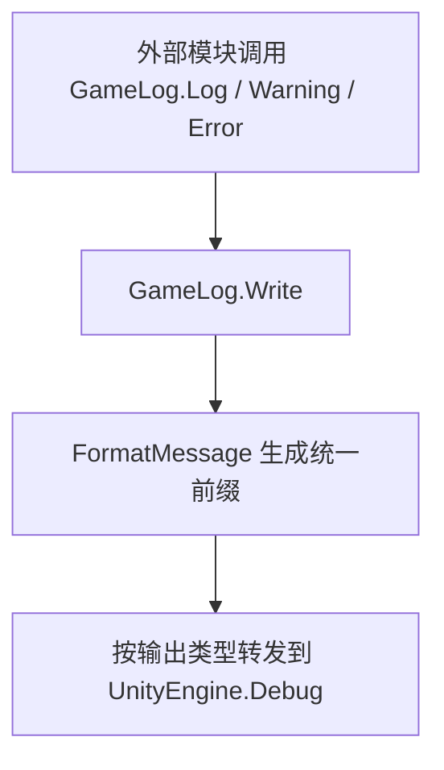

# Shared.Runtime.Logging 模块说明

## 1. 模块交互

### 对外接口

| 接口 | 说明 |
| --- | --- |
| `GameLog.Log` | 提供普通日志统一输出入口 |
| `GameLog.Warning` | 提供警告日志统一输出入口 |
| `GameLog.Error` | 提供错误日志统一输出入口 |
| `GameLogModule` | 提供统一模块名枚举，用于日志归类 |

### 外部模块依赖

#### `UnityEngine`

| 模块接口 | 描述说明 |
| --- | --- |
| `Debug.Log` | 输出普通日志到 Unity Console |
| `Debug.LogWarning` | 输出警告日志到 Unity Console |
| `Debug.LogError` | 输出错误日志到 Unity Console |

#### `System.Text`

| 模块接口 | 描述说明 |
| --- | --- |
| `StringBuilder.Append` | 拼装统一日志前缀与消息体 |

## 2. 模块流程图

## 3. 当前实现备注

| 项 | 说明 |
| --- | --- |
| 当前风险 | 高频逻辑如果直接频繁调用日志接口，仍会造成 Console 噪声与性能开销 |
| 当前限制 | 当前仅 `Debug` 模块配置了颜色标签，其他模块仍使用默认颜色 |
| 后续建议 | 后续可补日志级别开关、模块过滤与测试辅助钩子，降低测试和运行时噪声 |
