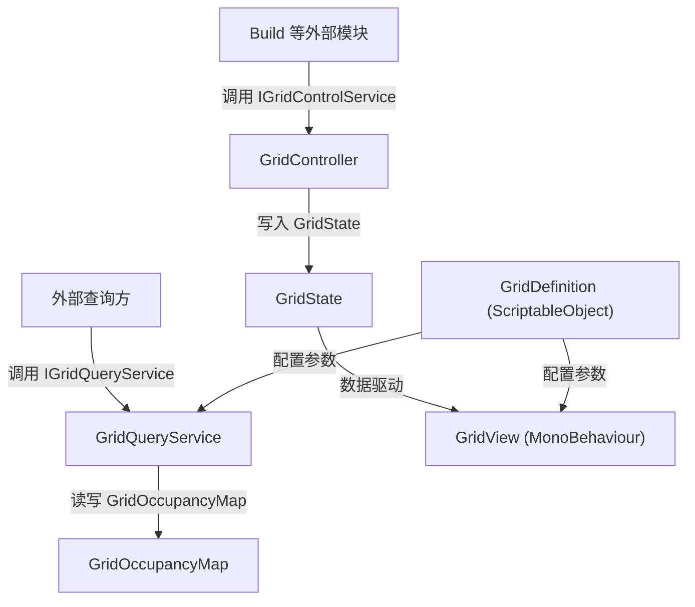

# Grid 模块

## 1. 模块交互

### 对外接口

| 接口 | 说明 |
| --- | --- |
| `IGridControlService.ShowGrid()` | 显示网格 |
| `IGridControlService.HideGrid()` | 隐藏网格，并联动清除悬停与预览状态 |
| `IGridControlService.SetHoverCoord(GridCoord?)` | 更新悬停坐标，传 null 取消悬停 |
| `IGridControlService.SetPreviewFootprint(GridFootprint, bool)` | 设置预览占地区域及其有效性 |
| `IGridControlService.ClearPreviewFootprint()` | 清除预览占地区域 |
| `IGridControlService.AddOccupiedFootprint(GridFootprint)` | 添加一片占地到显示状态 |
| `IGridControlService.RemoveOccupiedFootprint(GridFootprint)` | 从显示状态移除一片占地 |
| `IGridControlService.GridState` | 获取当前网格显示状态（只读） |
| `IGridQueryService.TryWorldToCoord(Vector3, out GridCoord)` | 世界坐标 → 网格坐标 |
| `IGridQueryService.CoordToWorldCenter(GridCoord, float)` | 网格坐标 → 格心世界坐标 |
| `IGridQueryService.SnapWorldToCenter(Vector3)` | 世界坐标吸附到最近格心 |
| `IGridQueryService.GetFootprintCoords(GridFootprint)` | 计算占地覆盖的全部格坐标 |
| `IGridQueryService.IsCoordInBounds(GridCoord)` | 判断单格是否在网格范围内 |
| `IGridQueryService.IsFootprintInBounds(GridFootprint)` | 判断占地是否在网格范围内 |
| `IGridQueryService.IsCoordOccupied(GridCoord)` | 判断单格是否已被占用 |
| `IGridQueryService.IsFootprintOccupied(GridFootprint)` | 判断占地是否存在已占用格 |
| `IGridQueryService.OccupyFootprint(GridFootprint)` | 记录一片占地 |
| `IGridQueryService.ReleaseFootprint(GridFootprint)` | 释放一片占地 |
| `IGridQueryService.ClearOccupancy()` | 清空全部占格记录 |

### 外部模块依赖

#### `Common`

| 模块接口 | 描述说明 |
| --- | --- |
| `IDataValidationSelfCheck` | `GridDefinition` 实现自校验接口 |

#### `UnityEngine`

| 模块接口 | 描述说明 |
| --- | --- |
| `Vector2Int` | `GridFootprint.Size` 使用 |
| `Vector3` | `IGridQueryService` 坐标换算方法使用 |

## 2. 模块流程图

## 3. 当前实现备注

| 项 | 说明 |
| --- | --- |
| 当前风险 | `GridQueryService` 全部方法为 `NotImplementedException`，尚未实现 |
| 当前风险 | 缺少 VContainer DI 注册（Installer），`IGridControlService` / `IGridQueryService` 未绑定到实现类，`GridView` 的 `[Inject]` 无法生效 |
| 当前限制 | `GridView.HandleOccupiedChanged` 使用全量重建策略，占用标记变更时会销毁并重建所有实例 |
| 后续建议 | 实现 `GridQueryService`，注入 `GridDefinition` 和 `GridOccupancyMap` 依赖 |
| 后续建议 | 添加 VContainer LifetimeScope 将服务注册到 DI 容器 |
| 后续建议 | 占用标记增量更新，替代全量重建 |
