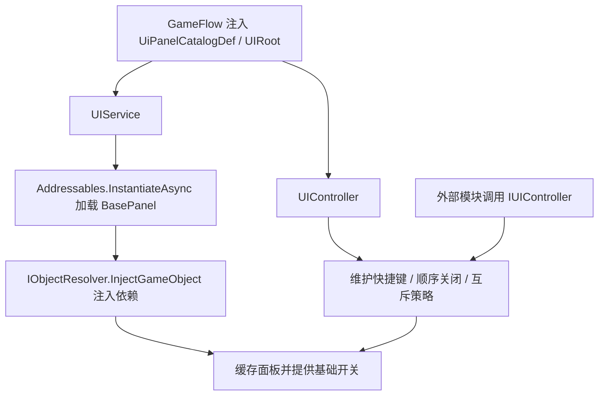

# UI 模块说明

## 1. 模块交互

### 对外接口

| 接口 | 说明 |
| --- | --- |
| `IUIController.IsPanelOpen` | 提供面板打开状态查询 |
| `IUIController.OpenPanel` | 提供面板打开入口 |
| `IUIController.ClosePanel` | 提供面板关闭入口 |
| `IUIController.CloseLastOpenedPanel` | 提供按最近打开顺序关闭面板的入口 |
| `IUIController.TogglePanel` | 提供面板显隐切换入口 |

### 外部模块依赖

#### `Build`

| 模块接口 | 描述说明 |
| --- | --- |
| 无 | 建造面板已归属 `Build` 模块，UI 模块不再直接承载建造业务入口 |

#### `UI.Definitions`

| 模块接口 | 描述说明 |
| --- | --- |
| `UiPanelCatalogDef.PanelEntries` | 提供全部 UI 面板目录条目 |
| `UiPanelEntryDef.PanelId` | 读取面板唯一标识 |
| `UiPanelEntryDef.AddressKey` | 读取面板 Addressable 地址键 |
| `UiPanelEntryDef.Layer` | 读取面板挂载层级 |
| `UiPanelEntryDef.OpenOnStartup` | 读取面板是否启动默认打开 |
| `UiPanelEntryDef.CloseByCancel` | 读取面板是否参与取消关闭顺序 |
| `UiPanelEntryDef.ExclusivePanelIds` | 读取面板互斥配置 |

#### `UI.Presentation`

| 模块接口 | 描述说明 |
| --- | --- |
| `UIRoot.GetLayerRoot` | 按层级枚举返回已通过 Inspector 绑定的层级根节点 |
| `BasePanel.PanelId` | 读取运行时面板唯一标识 |
| `BasePanel.Open` | 打开面板实例 |
| `BasePanel.Close` | 关闭面板实例 |
| `BasePanel.IsOpen` | 读取面板当前打开状态 |

#### `VContainer`

| 模块接口 | 描述说明 |
| --- | --- |
| `IObjectResolver.InjectGameObject` | 对运行时实例化的面板对象执行依赖注入 |

#### `Unity Addressables`

| 模块接口 | 描述说明 |
| --- | --- |
| `Addressables.InstantiateAsync` | 按目录配置异步实例化面板预制体 |
| `Addressables.ReleaseInstance` | 释放已缓存的面板实例 |

#### `UnityEngine`

| 模块接口 | 描述说明 |
| --- | --- |
| `Transform.SetAsLastSibling` | 调整面板显示顺序，保证后打开面板显示在前 |

## 2. 模块流程图

## 3. 当前实现备注

| 项 | 说明 |
| --- | --- |
| 当前风险 | 装配层对 UI 仍是硬依赖；UI 面板初始化仍是异步 fire-and-forget |
| 当前限制 | 当前层级节点依赖场景中的 `UIRoot` 组件显式绑定 |
| 当前结论 | `UIController` 负责快捷键、互斥、打开顺序与取消关闭，`UIService` 只负责底层加载与基础开关 |
| 后续建议 | 先补初始化完成信号，再补 UI 模块测试与可重绑定配置持久化 |
