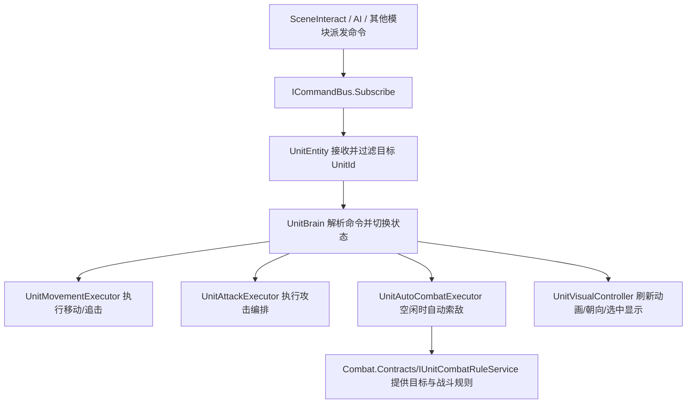

# Unit 模块 README

## 1. 模块交互

### 对外接口

| 接口 | 说明 |
| --- | --- |
| `Contracts/Command/UnitMoveCommand` | 外部模块向指定单位下发移动命令的数据契约。 |
| `Contracts/Command/UnitAttackCommand` | 外部模块向指定单位下发攻击命令的数据契约。 |
| `Contracts/Model/UnitId` | 运行时单位唯一标识，用于跨模块定位具体单位实例。 |
| `Contracts/Identity/IUnitIdentity` | 对外公开单位运行时身份的最小契约，供其他模块安全读取 `UnitId`。 |

### 外部模块依赖

#### `Command`

| 模块接口 | 描述说明 |
| --- | --- |
| `ICommandBus.Subscribe<TCommand>` | `UnitEntity` 订阅移动命令与攻击命令，接收外部模块派发的单位指令。 |

#### `Combat.Contracts`

| 模块接口 | 描述说明 |
| --- | --- |
| `IUnitCombatRuleService.TryGetAutoAttackTarget` | 在单位空闲时提供自动索敌目标。 |
| `IUnitCombatRuleService.IsTargetValid` | 判断当前攻击目标是否仍然有效。 |
| `IUnitCombatRuleService.IsTargetInAttackRange` | 判断当前单位与目标是否已进入攻击范围。 |
| `IUnitCombatRuleService.TryExecuteAttack` | 在进入攻击范围后执行一次攻击结算。 |

## 2. 模块流程图

## 3. 当前实现备注

| 项 | 说明 |
| --- | --- |
| 当前风险 | `Unit` 目前仍分别订阅移动命令和攻击命令，底层命令总线尚不支持直接按 `ICommand` 统一订阅。 |
| 当前限制 | `Unit` 只负责战斗编排，不负责伤害、冷却、命中等具体战斗规则；相关逻辑由 `Combat` 模块实现。 |
| 后续建议 | 后续可优先改造 `Command` 模块的分发机制，使其支持接口级订阅，这样 `Unit` 可收敛为单一命令入口链路。 |
