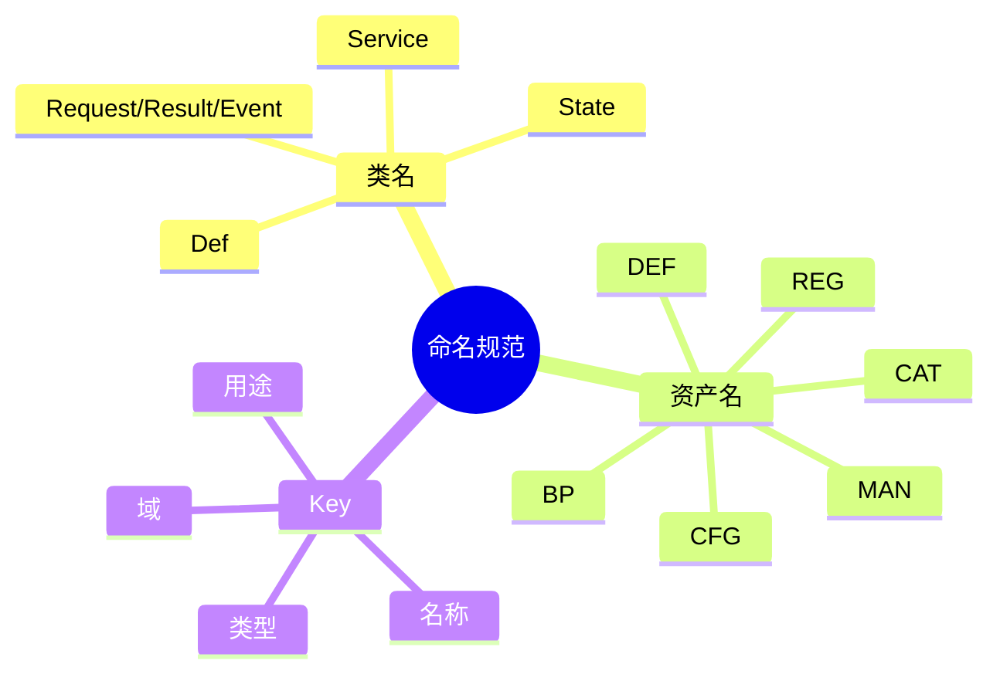

# 命名规范

## 1. 目标

统一项目中的类名、配置资产名、内容资产名与 Addressable Key，避免同一语义出现多套命名方式。

## 2. 类命名规则

| 类型 | 命名规则 | 示例 |
| --- | --- | --- |
| 定义数据类 | `*Def` | `UnitDef`、`BuildingDef` |
| 运行时状态 | `*State` | `UnitState`、`BuildingState` |
| 服务类 | `*Service` | `CombatService`、`UIService` |
| 系统类 | `*System` | `CombatSystem` |
| 请求对象 | `*Request` | `AttackRequest` |
| 结果对象 | `*Result` | `DamageResult` |
| 事件对象 | `*Event` | `UnitDeadEvent` |
| 接口 | `I*` | `ICombatService` |
| 编辑器窗口 | `*Window` | `DefinitionWindow` |
| 自定义检查器 | `*Editor` / `*Inspector` | `UnitDefEditor` |

## 3. 缩写统一规则

| 原词 | 统一写法 |
| --- | --- |
| Definition | `Def` |
| Blueprint | `Blueprint` |
| Catalog | `Catalog` |
| Manifest | `Manifest` |
| Configuration | `Config` |
| Reference | `Ref` |
| Identifier | `Id` |

## 4. 资产命名规则

### 4.1 前缀规则

| 资产类型 | 前缀 | 命名格式 | 示例 |
| --- | --- | --- | --- |
| 定义资产 | `DEF` | `DEF_<TYPE>_<NAME>` | `DEF_BLD_Barracks` |
| 蓝图资产 | `BP` | `BP_<TYPE>_<NAME>` | `BP_BLD_Barracks` |
| 目录资产 | `CAT` | `CAT_<DOMAIN>_<NAME>` | `CAT_BUILD_Default` |
| Manifest 资产 | `MAN` | `MAN_<DOMAIN>_<NAME>` | `MAN_CONTENT_Default` |
| 启动配置资产 | `CFG` | `CFG_<DOMAIN>_<NAME>` | `CFG_GAMESTARTUP_Default` |
| 注册表资产 | `REG` | `REG_<DOMAIN>_<NAME>` | `REG_UI_Default` |

### 4.2 类型缩写

| 语义 | 缩写 |
| --- | --- |
| 建筑 | `BLD` |
| 单位 | `UNIT` |
| 攻击 | `ATK` |
| 阵营 | `FAC` |
| 界面 | `UI` |
| 建造 | `BUILD` |
| 内容 | `CONTENT` |

### 4.3 使用约束

| 规则 |
| --- |
| `DEF` 只用于可复用的基础定义资产，如建筑定义、单位定义、攻击定义。 |
| `BP` 只用于“可被生产、建造、生成”的蓝图语义，不和 `DEF` 混用。 |
| `CAT` 用于某一类内容清单，不承担全局万能注册表职责。 |
| `MAN` 用于聚合多个目录或配置入口的内容清单。 |
| `CFG` 用于启动期装配、运行入口、场景入口等配置。 |
| `REG` 仅在确实需要注册表语义时使用，不推荐作为所有内容的统一中心。 |

## 5. Addressable Key 规则

### 5.1 格式

`<Domain>.<Type>.<Name>.<Purpose>`

### 5.2 示例

| 资源 | Key 示例 |
| --- | --- |
| 建筑运行时预制体 | `Building.Runtime.Barracks.Prefab` |
| 建筑面板 | `UI.Panel.Build.Main` |
| 仓库面板 | `UI.Panel.Inventory.Main` |
| 生产面板 | `UI.Panel.Production.Main` |

### 5.3 约束

| 规则 |
| --- |
| Key 使用 PascalCase 分段，不使用空格。 |
| `Domain` 表示业务域，如 `UI`、`Building`、`Unit`。 |
| `Type` 表示资源类别，如 `Panel`、`Runtime`、`Icon`。 |
| `Name` 表示业务名词，如 `Barracks`、`Build`。 |
| `Purpose` 表示用途，如 `Main`、`Prefab`、`Icon`。 |

## 6. 推荐映射

| 语义 | 类名示例 | 资产名示例 |
| --- | --- | --- |
| 建筑定义 | `BuildingDef` | `DEF_BLD_Barracks` |
| 建筑蓝图 | `BlueprintDef` | `BP_BLD_Barracks` |
| 建造目录 | `BuildCatalogDef` | `CAT_BUILD_Default` |
| UI 目录 | `UiPanelCatalogDef` | `CAT_UI_Default` |
| 内容总清单 | `GameContentManifest` | `MAN_CONTENT_Default` |
| 启动配置 | `GameStartupConfig` | `CFG_GAMESTARTUP_Default` |

