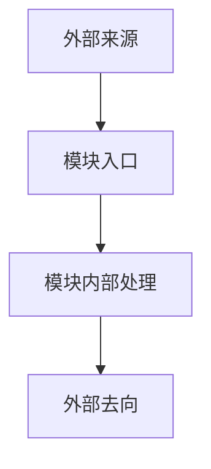

# 模块 README 模板

> 用途：用于描述一个系统/模块与外部的交互边界、流程与当前实现备注。  
> 原则：只写跨模块信息流，保持简洁、可落地、可审查。

## 1. 模块交互

### 对外接口

| 接口 | 说明 |
| --- | --- |
|  |  |
|  |  |

### 外部模块依赖

#### `模块名`

| 模块接口 | 描述说明 |
| --- | --- |
|  |  |
|  |  |

交互表要求：

- `对外接口`：只写其他模块可以直接调用、查询或显式依赖的稳定接口；如果模块只是订阅事件、消费命令或被动响应外部驱动，不算对外接口
- `外部模块依赖`：按模块分表，写清楚本模块依赖了该模块的哪些方法、事件、属性或数据契约，不要只写类名
- 优先写到“接口级”或“成员级”，例如方法名、事件名、属性名、命令入口名
- 如果当前没有稳定跨模块公开接口，要明确写 `无`

## 2. 模块流程图

## 3. 当前实现备注

| 项 | 说明 |
| --- | --- |
| 当前风险 |  |
| 当前限制 |  |
| 后续建议 |  |
